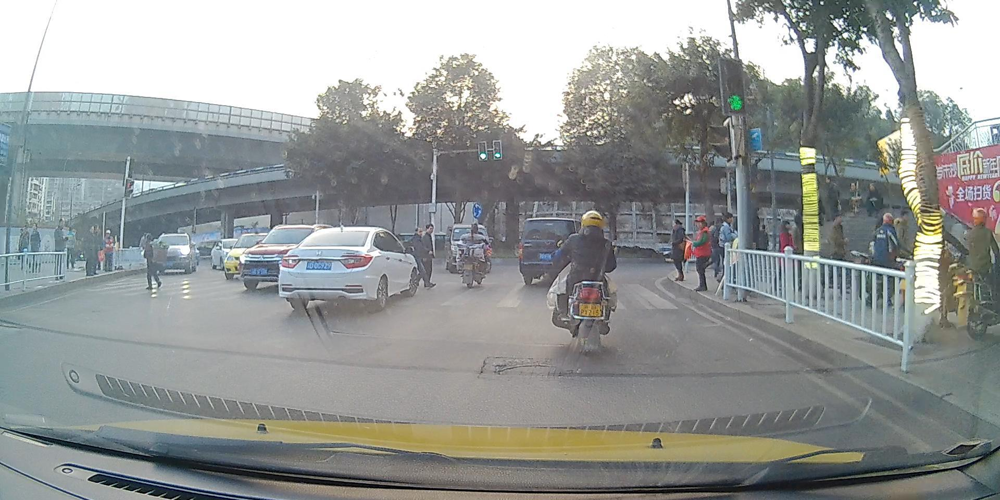
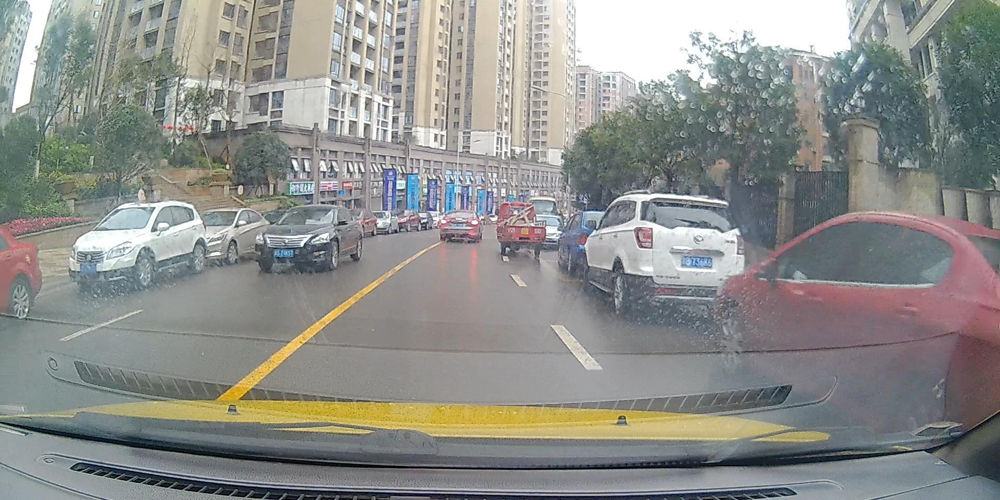

# LSCUT
## The Large-Scale China Urban Traffic (LSCUT) dataset

### Introduction
Now,  the Large-Scale China Urban Traffic object detection dataset is available. The images in different weathers can be found in different folders. Each image is labled as: Category 0 0 0 xmin ymin xmax ymax. 

Car, Pedestrian, Cyclist, Traffic sign, Obstacle, and Traffic light are all labeled. The detailed category description can be found in Category description.pdf

### Download links for part of our dataset
  Set 00 / Day / 14, 337 frames: [Link](https://pan.baidu.com/s/1sPYM_fbubakAUcMVKBDrCw), Extracted code：hgd0 
  
  Set 01 / Night / 11, 411 frames: [Link](https://pan.baidu.com/s/1El74dW3_f9Mzr5dghD8QhA), Extracted code：a3g3 
  
  Set 02 / Rain / 6, 209 frames: [Link](https://pan.baidu.com/s/1Yv1X_a3p1nzsp6MaPWpnnQ), Extracted code：8h2u 
  
  Set 03 / Snow / 5, 089 frames: [Link](https://pan.baidu.com/s/1UemsAZpgul5m22vM3G0x9Q), Extracted code：lj26 

### Acknowledge
Thanks Beijing HuaHang Radio Measurement Institute for help.

### Citation
If you use our dataset for your research, please consider citing our paper.

@inproceedings{dai19dszrnet,

author = {Xuerui Dai, Xue Yuan, Liu Pei, and Xueye Wei},

title = {Deeply Supervised Z-style Residual Network Devotes to Real-time Environment Perception for Autonomous Driving},

journal={IEEE Transactions on Intelligent Transportation Systems}

year = {2019},

}

Thank you for your attention.  
